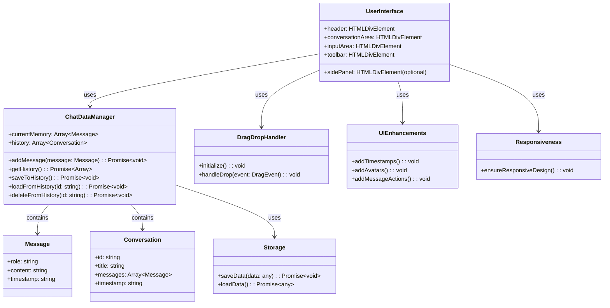

# Chatbot Compliance Implementation Plan

## 1. Introduction

This document outlines the implementation plan for addressing the recommendations in the chatbot_compliance_report.md. The plan prioritizes fundamental features first, followed by UI enhancements and additional functionality.

## 2. Architecture Overview

## 3. Implementation Plan

### 3.1 Long-term Memory with Persistent Storage

**Objective:** Implement persistent storage using IndexedDB to maintain chat history across sessions.

**Tasks:**
1. Complete the IndexedDB implementation in `chatbot-data.js`
2. Ensure all chat messages are stored in IndexedDB
3. Implement migration from cookies to IndexedDB
4. Add error handling and fallback mechanisms

### 3.2 Conversation History Management

**Objective:** Add features for naming, deleting, and exporting chats.

**Tasks:**
1. Implement conversation history UI in the side panel
2. Add functionality to name conversations
3. Implement delete conversation feature
4. Add export conversation functionality (JSON format)

### 3.3 Drag-and-Drop File Uploads

**Objective:** Implement drag-and-drop file upload functionality in the input box.

**Tasks:**
1. Add drag-and-drop event listeners to the input area
2. Implement file handling and preview
3. Update UI to show uploaded files
4. Add file sending functionality to backend

### 3.4 Optional Message Enhancements

**Objective:** Add timestamps, avatars, and message actions.

**Tasks:**
1. Add timestamps to each message
2. Implement user/assistant avatars
3. Add message actions (thumbs up/down, copy)

### 3.5 Ensure CSS Responsiveness

**Objective:** Make the chatbot UI responsive across different screen sizes.

**Tasks:**
1. Review and update CSS in `chatbot.css`
2. Add media queries for different screen sizes
3. Test responsiveness on various devices

### 3.6 Side Panel for Saved Conversations and Settings

**Objective:** Add a side panel for accessing saved conversations and settings.

**Tasks:**
1. Design side panel UI
2. Implement conversation list display
3. Add settings section to the side panel

### 3.7 Toolbar Buttons for Additional Functionality

**Objective:** Add toolbar buttons for Clear Chat, Save Chat, etc.

**Tasks:**
1. Design toolbar UI
2. Implement Clear Chat button functionality
3. Implement Save Chat button functionality
4. Add additional buttons as needed

## 4. Implementation Phases

### Phase 1: Core Functionality
- Long-term memory with persistent storage
- Conversation history management

### Phase 2: UI Enhancements
- Drag-and-drop file uploads
- Message enhancements (timestamps, avatars, actions)

### Phase 3: Design and Responsiveness
- Ensure CSS responsiveness
- Add side panel for conversations and settings

### Phase 4: Final Touches
- Implement toolbar buttons
- Final testing and polishing

## 5. Testing Plan

1. Unit tests for data storage and retrieval
2. Integration tests for UI components
3. End-to-end tests for user workflows
4. Responsiveness testing on various devices
5. User acceptance testing

## 6. Conclusion

This implementation plan addresses all recommendations from the chatbot_compliance_report.md. By following this plan, we will enhance the chatbot's functionality, improve user experience, and ensure compliance with the specified requirements.